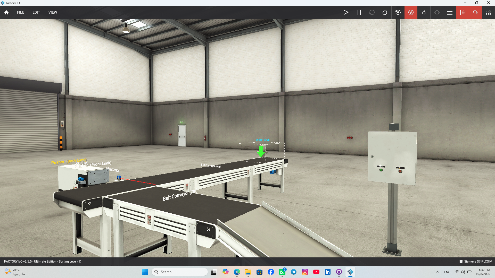
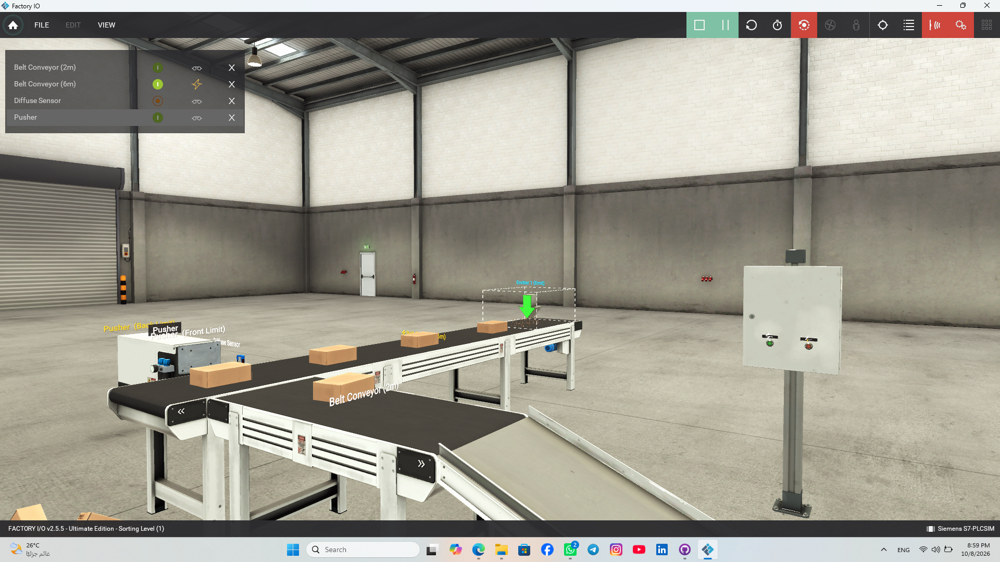
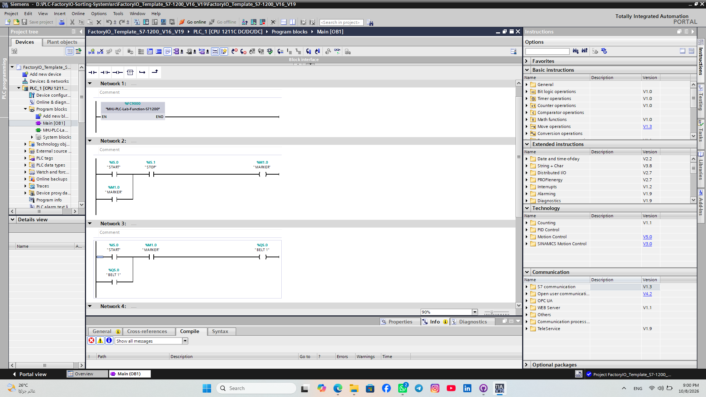
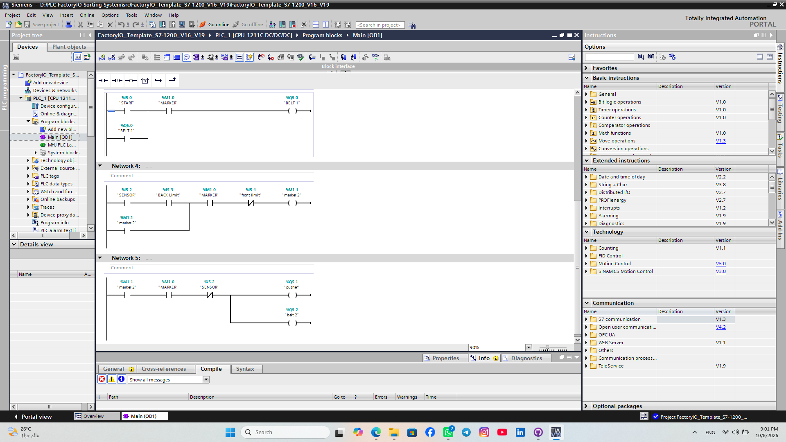

# Industrial Conveyor Sorting System (PLC S7-1200 & Factory I/O)

## 📌 Project Overview
An automated industrial material handling and sorting system designed to classify items based on specific conditions using Siemens S7-1200 PLC logic, integrated with a 3D Factory I/O simulation model.

## 🛠 Tech Stack & Software
* **PLC Controller:** Siemens S7-1200
* **Programming Software:** Siemens TIA Portal
* **Programming Language:** Ladder Logic (LAD)
* **Simulation Environment:** Factory I/O (3D Scene)
* **Version Control:** Git & GitHub

## 📁 Repository Structure
```
├── src/   # TIA Portal project files & Factory I/O scene files
└── docs/  # System architecture diagrams, setup guidelines, and demo media
```

## 🖼️ System Demonstration & Logic

### 1. 3D Factory I/O Environment
| Before Start | After System Start |
| :---: | :---: |
|  |  |

### 2. TIA Portal Ladder Logic (LAD)
| Logic Segment 1 | Logic Segment 2 |
| :---: | :---: |
|  |  |

## ⚙️ Control Strategy & Features
* Automated conveyor control for continuous material flow.
* Sensor-based item detection and sorting mechanisms.
* Real-time I/O mapping between TIA Portal and Factory I/O via PLCSIM.
* Emergency Stop and Manual/Auto operation modes.
